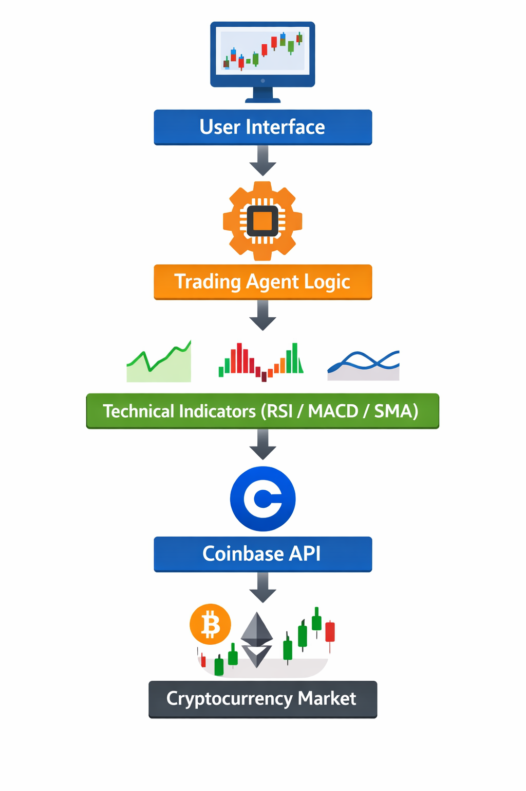

# AI Crypto Trading Agent

An automated cryptocurrency trading agent that analyzes market signals and executes trading decisions using technical indicators.

The agent connects to the Coinbase Advanced Trade API and evaluates market conditions using RSI, MACD, and SMA indicators.

---

## Architecture

User Interface
     |
Trading Agent Logic
     |
Technical Indicators
(RSI / MACD / SMA)
     |
Coinbase API
     |
Cryptocurrency Market

---

## Features

- real-time BTC price monitoring
- automated trading decision engine
- RSI momentum analysis
- MACD crossover detection
- SMA trend analysis
- automated market order execution

---

## Technologies

- JavaScript
- React
- Coinbase Advanced Trade API
- Web Crypto API
- Technical Analysis Algorithms

---

## Future Improvements

- machine learning trading models
- portfolio risk management
- backtesting engine
- cloud deployment on AWS
